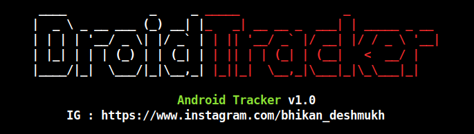

<p align="center"><a> </a>

<p align="center">
	
</p>

# <p align="center">DroidTracker

<p align="center">
<a href="https://github.com/bhikandeshmukh"></a>
 <a href="https://github.com/bhikandeshmukh/Termux-Keys"></a>
 <a href="https://github.com/bhikandeshmukh"></a>
</p>

### Features:
#### Custom App Name
#### 2 Port Forwarding options (Ngrok or using SSH Tunneling with Serveo.net)
#### Obfuscated URL by Tinyurl
#### Fully Undetectable

### Auto Install:

```
# bash install.sh
```

### Installing on Kali Linux:
```
Install dependencies:
# apt-get update
# apt-get install default-jdk apksigner

For x86:
# apt-get install libc6-dev-i386 lib32z1

For AMD64:
# apt-get install lib32z1 lib32ncurses6 lib32stdc++6

Download SDK-Tools:
# wget https://dl.google.com/android/repository/sdk-tools-linux-4333796.zip
#mkdir -p $HOME/Android/Sdk
# unzip sdk-tools-linux* -d $HOME/Android/Sdk

Install SDKMAN
# curl -s "https://get.sdkman.io" | bash
# source "$HOME/.sdkman/bin/sdkman-init.sh"
# echo "Y" | sdk install java 8.0.191-oracle
# sdk use java 8.0.191-oracle
# sdk install gradle 2.14.1
# sdk use gradle 2.14.1

# echo "y" | $HOME/Android/Sdk/tools/bin/sdkmanager "platforms;android-25" "build-tools;25.0.1" "extras;google;m2repository" "extras;android;m2repository"

# git clone https://github.com/bhikandeshmukh/DroidTracker
# cd DroidTracker
# bash droidtracker.sh
```
## Legal Disclaimer:

Usage of the tool for attacking targets without prior mutual consent is illegal. It's the end user's responsibility to obey all applicable local, state and federal laws. Developers assume no liability and are not responsible for any misuse or damage caused by this program

<p>DroidTracker is created to help in penetration testing and it's not responsible for any misuse or illegal purposes.</p>
<p>DroidTracker is inspired by https://github.com/thelinuxchoice/ Big thanks to @thelinuxchoice</p>

<p align="center">
<h4 align="center">♨️ FOLLOW ♨️<h4 align="center">
<a href="https://www.instagram.com/bhikan_deshmukh/"></a>
<a href="https://wa.me/918600525401"></a>
<a href="https://www.facebook.com/thebhikandeshmukh"></a>
<a href="https://www.twitter.com/bhikan_deshmukh/"></a>
<a href="https://t.me/dev_aladdin"></a>
<a href="https://rzp.io/l/mrbee"></a>
<a href="https://blockchain.com/btc/payment_request?address=3FH8UiVVKE5RkCaoaJ9Drr33Dg9L9FtsAq&amount=0.00008703&message=DONATE"></a>
</p>  


